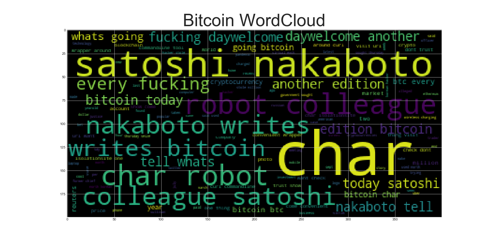
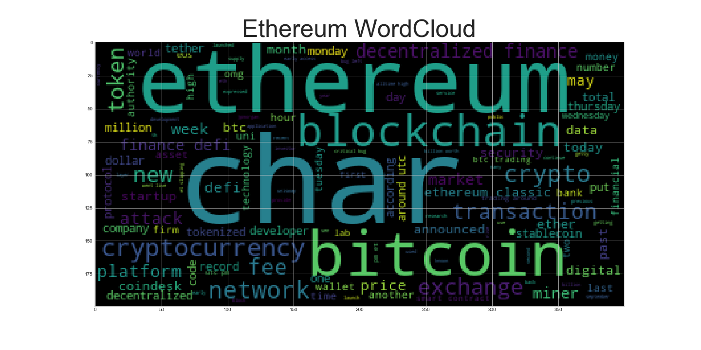
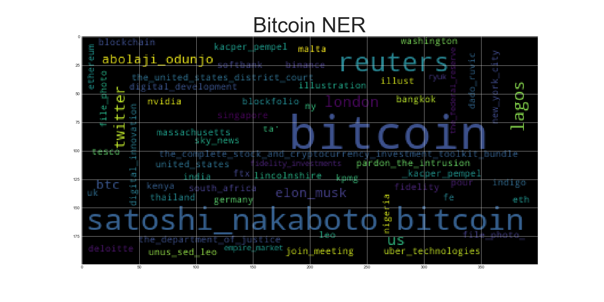
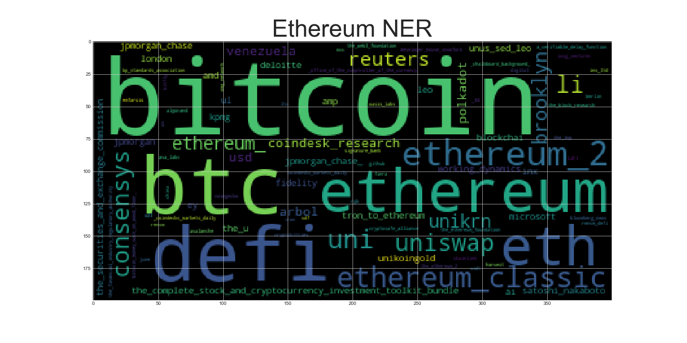

# Tales from the Crypto

## Sentiment Analysis
Use the newsapi to pull the latest news articles for Bitcoin and Ethereum and create a DataFrame of sentiment scores for each coin.
Use descriptive statistics to answer the following questions:

Q: Which coin had the highest mean positive score?
A: Bitcoin has the higher mean positive score compared to Ethereum (0.0776 for Bitcoin and 0.0694 for Ethereum). 

Q: Which coin had the highest compound score?
A: Bitcoin has the highest compound score (0.9231). 

Q. Which coin had the highest positive score?
A: Bitcoin has the highest compound score (0.326). 

## Natural Language Processing

Next, look at the ngrams and word frequency for each coin.
Use NLTK to produce the ngrams for N = 2 through *all* Bitcoin articles. Here is the list of top 10 words for Bitcoin: 

('satoshi', 'nakaboto'): 42, 
('char', 'robot'): 21, 
('robot', 'colleague'): 21, 
('colleague', 'satoshi'): 21, 
('nakaboto', 'writes'): 21, 
('writes', 'bitcoin'): 21, 
('every', 'fucking'): 21, 
('fucking', 'daywelcome'): 21, 
('daywelcome', 'another'): 21, 
('another', 'edition'): 21

Top 10 words for Ethereum:

('char', 'ethereum'): 11, 
('decentralized', 'finance'): 10, 
('finance', 'defi'): 8, 
('ethereum', 'blockchain'): 6, 
('char', 'bitcoin'): 6, 
('ethereum', 'classic'): 6, 
('around', 'utc'): 5, 
('ethereum', 'miner'): 5, 
('ether', 'char'): 4, 
('smart', 'contract'): 4

Finally, generate word clouds for each coin to summarize the news for each coin.

## Named Entity Recognition

In this section, I build a named entity recognition model for both coins and visualize the tags using SpaCy.

